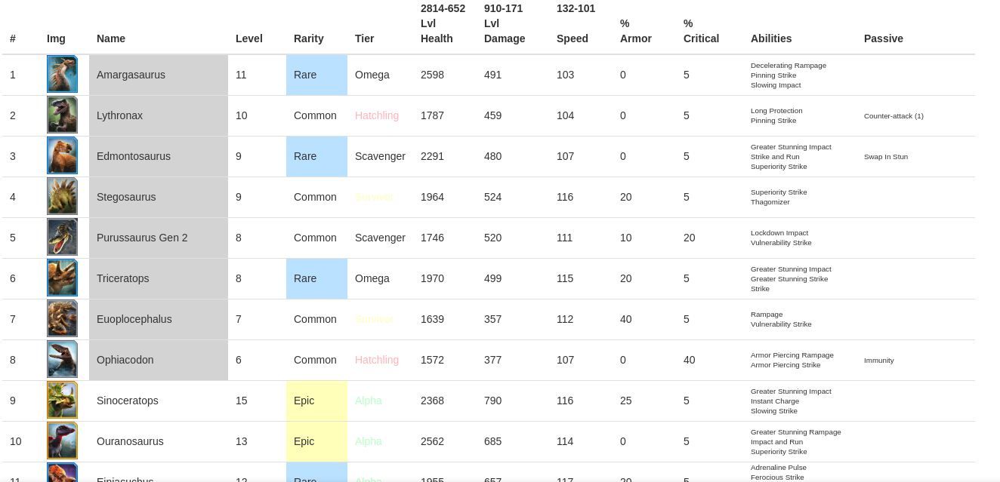

#### Screenshot

#### About

This is a utility that helps me track my collection of dinosaurs in the mobile game Jurassic World ALive.

#### Setup

1. Modify the `Collection` object in `data.js` to match the values from your in-game account.
2. Using the config files under the `/webscraper` directory, run the Google Chrome extension `Web Scraper` to scrape for current dino meta-statistics, and paste the output in the respective variables in `data.js`.

#### Run

1. Open `index.html` in a browser.

#### Dependencies

- jQuery
- Lodash
- Sortable
- Web Scraper extension for Google Chrome
